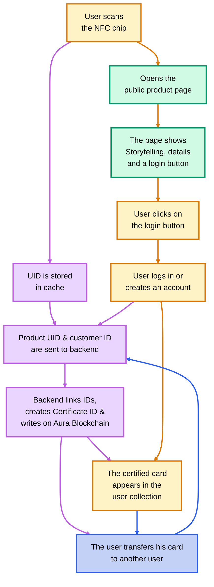

# LVMH Digital Product Passport

A project for the LVMH Hackathon at Albert School, aiming to transform the Digital Product Passport (DPP) from a regulatory requirement into a powerful tool for building trust, prestige, and long-term client engagement.

## 🎯 Project Vision

Our vision is to transform the mandatory disclosure of the Digital Product Passport into a powerful lever for trust, prestige, and long-term client engagement for Louis Vuitton. We've created a comprehensive framework and strategic roadmap that integrates technical architecture with a premium user experience, turning regulatory mandates into brand opportunities.

## ❤️ Core Concept: Emotional Encrage

The user experience is meticulously crafted around a four-stage emotional journey, designed not just to inform, but to deeply anchor the client's connection with the product and the Maison:

1.  **Attraction:** Immersive product storytelling, designed to capture immediate emotional attention through high-fidelity luxury references.
2.  **Confidence:** Instant and verifiable proof of authenticity via the Aura Blockchain, transforming storytelling into "story-proving" and building profound trust.
3.  **Empowerment:** A lifelong care and longevity hub, providing high-end maintenance tutorials and certified service directories, reinforcing product durability and deepening client relationship.
4.  **Serenity:** Transparent and compliant regulatory information, positioned to signal excellence and transparency without disrupting the initial emotional spark.

This emotional journey is carefully planned to seamlessly transition the client from subconscious desire to conscious trust, fostering a lasting bond.

## 💡 The Key Differentiator: Invitation-Only Events

By linking a product's unique ID to a user's account, we can organize exclusive, invitation-only events for product owners. This reinforces the brand's prestige and drives customer lifetime value.

## ✨ Key Features

### Personal Collection 
Beyond the seamless flow, user satisfaction is elevated by a unique new feature: a personal collection of high-fidelity 3D authenticity certification cards. This digital showcase not only fosters a strong sense of exclusivity and personalization but also subtly cultivates a desire to expand and complete the collection, a feeling powerfully reinforced by the presence of artfully presented empty slots.

### Transfer of Ownership
A logged-in user can initiate the transfer of one of their authenticity certificates to another user. The backend system will carry out the ownership change, including the corresponding update on the blockchain.

## 🔄 End-to-End User Journey

The following diagram illustrates the complete user journey, from the initial physical product interaction to the final certified digital ownership and beyond.


**Color Key:**
- 🟨 **User Flow:** Actions taken by the user.
- 🟩 **Public View:** Steps visible to any visitor.
- 🟪 **Backend Flow:** Simulated backend and blockchain interactions.
- 🟦 **New User Transfer:** The process for transferring ownership.
    
## 🏗️ App Architecture

The application is engineered for high scalability and responsiveness, built with a modular approach to seamlessly manage a diverse range of products. Its design emphasizes adaptability, allowing for the effortless integration of new product lines. To extend the product catalog, one simply needs to place the new product's assets into the `public/products` directory and update the product data within `lib/products.ts`.

## 📂 Project Structure   

The repository is organized as follows:

```
.
├── public/                             # Static assets served directly
│   └── products/                       # Product-specific images (organized by slug)
│       └── [product-slug]/             # Directory for each product's images (e.g., front.avif, side.avif)
├── app/                                # Next.js App Router root
│   ├── page.tsx                        # Root page, redirects to /collection
│   ├── products/[slug]/page.tsx        # Dynamic route for individual Digital Product Passports
│   ├── account-creation/page.tsx       # User account creation/login form
│   └── collection/page.tsx             # User's personalized product collection dashboard
├── components/                         # Reusable UI components
│   ├── page-dpp-section-[1-4].tsx      # Modular sections composing the DPP page
│   ├── feature-certificate-card.tsx    # Interactive 3D product certificate component
│   ├── feature-collection-grid.tsx     # Displays user's product collection and empty slots
│   └── ...                             # Other shared features and UI elements
├── contexts/                           # React Context providers for global state
│   └── user-context.tsx                # Manages user authentication and product ownership state
├── hooks/                              # Custom React hooks
│   └── use-mobile.ts                   # Hook to detect mobile devices
├── lib/                                # Utility functions and data
│   └── products.ts                     # Product data definitions and access helpers (e.g., getProductBySlug)
├── python/                             # Python utilities
│   ├── QR-code_generator.py            # Script to generate QR codes for DPP pages
│   └── DPP-qr-code.png                 # Generated QR code image
└── docs/                               # Project documentation and resources
    ├── PROJECT_CONTEXT.md              # Comprehensive project overview
    └── ...                             # Other documentation files
```

## 📱 QR Code Generation

The `python/` directory contains a utility script (`QR-code_generator.py`) for generating QR codes that link to product DPP pages.

**Important Note:** Unlike secure NFC chips, QR codes cannot certify a unique product UID. They are suitable for accessing the public product page (storytelling, details) but do not support the full user-linked certification flow. This makes QR codes ideal for:
- Demo/MVP presentations
- Less advanced deployments requiring only public product information
- Print materials and basic product traceability

For complete ownership certification and blockchain integration, secure NFC chips with unique UIDs are required.

## 🚀 Technical Stack

The project is built on a modern, robust, and scalable technical stack:

-   **Frontend:** Next.js 16, React 19, TypeScript
-   **Styling:** TailwindCSS 4, Framer Motion for animations
-   **UI Components:** Radix UI
-   **Blockchain:** Aura Blockchain for product authenticity
-   **Authentication:** A simplified demo using localStorage

## 🏃 Running Locally

To run this project on your local machine, follow these steps:

1.  **Clone the repository:**
    ```bash
    git clone https://github.com/vincent-20-100/LVMH_Hackathon.git
    cd LVMH_Hackathon
    ```

2.  **Install dependencies:**
    This project uses `npm` for package management.
    ```bash
    npm install
    ```

3.  **Run the development server:**
    This command starts the application in development mode.
    ```bash
    npm run dev
    ```
    Open [http://localhost:3000/LVMH_Hackathon](http://localhost:3000/LVMH_Hackathon) with your browser to see the result.

4.  **Build for production:**
    To create a production-ready build, run:
    ```bash
    npm run build
    ```
    And to start the production server:
    ```bash
    npm run start
    ```

## 🌐 Deployment

This project is designed for seamless deployment as a static site on **GitHub Pages**. This serverless approach was chosen for its high performance and cost-effectiveness, making it an ideal solution for a proof-of-concept. The repository can be cloned and the directory can be served statically without any complex installation.

[---> ACCESS TO THE DEPLOYED WEBSITE HERE <---](https://vincent-20-100.github.io/LVMH_Hackathon/)
